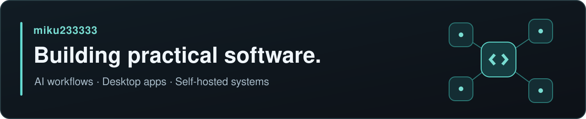

A few things I'm working on:

- [AI Agent MemoryHub](https://github.com/miku233333/aiagent-memoryhub) — A desktop memory hub for AI tools, built with FastAPI, SQLite, React, and Electron. It is currently a proof of concept.
- [Synology NAS MCP](https://github.com/miku233333/synology-nas-mcp) — A self-hosted Python MCP server for reading files from a Synology NAS. Currently in alpha.
- [VTC CLI](https://github.com/miku233333/vtc-cli) — An unofficial local command-line tool for accessing Moodle and MyPortal courses, assignments, and timetables.
