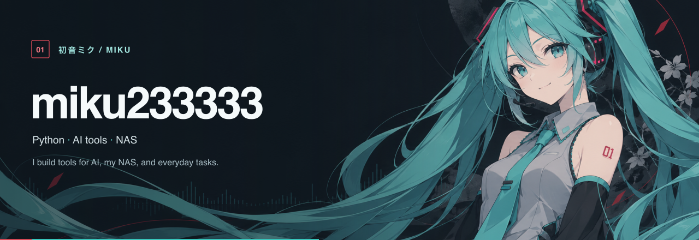

I build tools for AI, my NAS, and everyday tasks.

## Selected projects

| Project | Description | Status |
| --- | --- | --- |
| [**KianCode**](https://github.com/miku233333/kiancode) | A self-hosted agent runtime with durable tasks, scoped tools, multi-agent delegation, and device workspaces. TypeScript · Node.js | Open source |
| [**Synology NAS MCP**](https://github.com/miku233333/synology-nas-mcp) | A self-hosted Python MCP server for reading files from a Synology NAS. | Alpha |
| [**VTC CLI**](https://github.com/miku233333/vtc-cli) | A local command-line tool for accessing Moodle and MyPortal courses, assignments, and timetables. | Unofficial |
